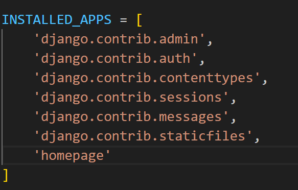

1.

```
pip install django

```
2.
```
django startproject <project_name>
 django-admin startapp <app name>
```
3.

Register the app to the setting.py





4.


from django.urls import path,include 
  path(include('homepage.urls'))


  5. create the urls.py in the homepage


  6. import the views.py in the urls.py


7. Register the template in the settings


8. Create a template folder in the app folder.

9. create a appname/<htmlfile>.html


Problem:
 How to add the file in the 

1. create a forms 
2. import in the views 
3. send throuhh the content and get in the html
4. recive the file in the request.method 
5. do os operations
6. Save the file in the upload
7. Save the filename, extension in the json and in the file in the upload
8. Redirect to the Operations/


Need to keep the verification system. But before we need to do the front end opraniztion for the bettterment.


